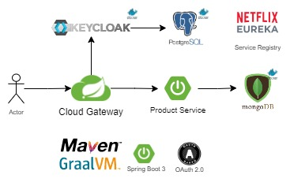

86 lines (67 sloc)  1.69 KB
## Keycloak Gateway 
### Spring Boot 3 - GraalVM



## 🔨 Run the App

#### Maven

<b>1 )</b> Download your project from this link shown below
```
    git clone https://github.com/Eukolos/gateway-keycloak.git
```

<b>2 )</b> Go to the project's home directory shown below
```
    cd gateway-keycloak
    
```

<b>3 )</b> Run Keycloak and Databases
```
    docker-compose up
```

<b>4 )</b> Run services
```
    cd eureka-server
    
    mvn spring-boot:run
    
    cd product-service
    
    mvn spring-boot:run
    
    cd gateway
    
    mvn spring-boot:run
    
```
### A few keycloak configuration after we can test endpoints

[We can make native image this services thanx to graalvm.](https://github.com/Eukolos/spring-boot-3-example/)

### Used Dependencies
* Core
    * Spring
        * Spring Boot 3
        * Spring Web
        * Spring Security
        * Oauth 2.0
* Keycloak
* MongoDB
* Postgesql
* Docker
* GraalVM CE Java 17-22.3.0

### Login with Keycloak UI

```

GET /v1/product
Accept: application/HTTP
Content-Type: application/HTTP
User-Agent: Chrome/108.0.0.0
{
"username" : "my_user",
"password" : "password",
}
RESPONSE: HTTP 200 (OK)
Location header: http://localhost:8889/v1/product
```

### Create a Product

```
POST /v1/product
Accept: application/json
Content-Type: application/json
{
"name" : "GraalVM",
"price" : "uber fasttt",
"amount" : "GraalVM",
"oemList" : [
        "15j2h15k215kjkjk52",
        "21321ewqe321j213as"
 ]
}
RESPONSE: HTTP 201 (CREATED)
Location header: http://localhost:8889/v1/product
```

### Get Procut List

```
GET /v1/product
Accept: application/json
Content-Type: application/json
{
}
RESPONSE: HTTP 200 (OK)
Content: ProductDto
Location header: http://localhost:8889/v1/product
```

### Get Product By Id

```
GET /v1/product/{id}
Accept: application/json
Content-Type: application/json
{
}
RESPONSE: HTTP 200 (OK)
Content: ProductDto
Location header: http://localhost:8889/v1/product/{id}
```

### Get Product By Oem

```
GET /v1/product/oem/{oem}
Accept: application/json
Content-Type: application/json
{
}
RESPONSE: HTTP 200 (OK)
Content: ProductDto
Location header: http://localhost:8889/v1/product/oem/{oem}
```

### Delete Product By Id

```
GET /v1/product/{id}
Accept: application/json
Content-Type: application/json
{
}
RESPONSE: HTTP 200 (OK)
Content: boolean
Location header: http://localhost:8889/v1/product/{id}
```
